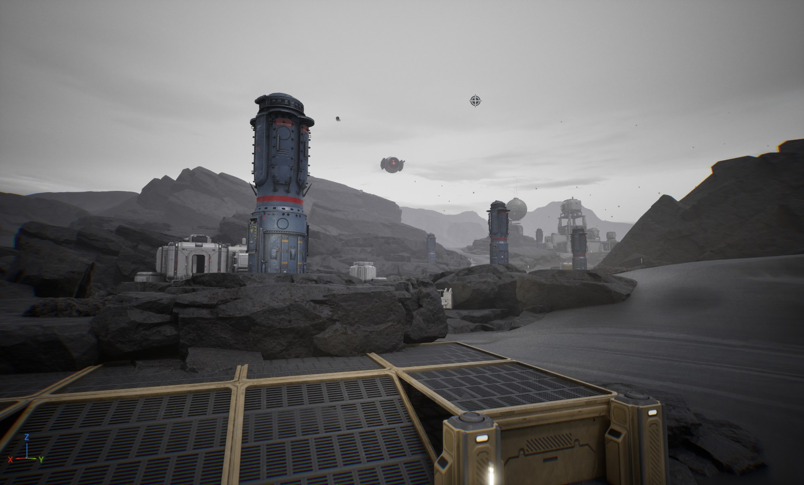
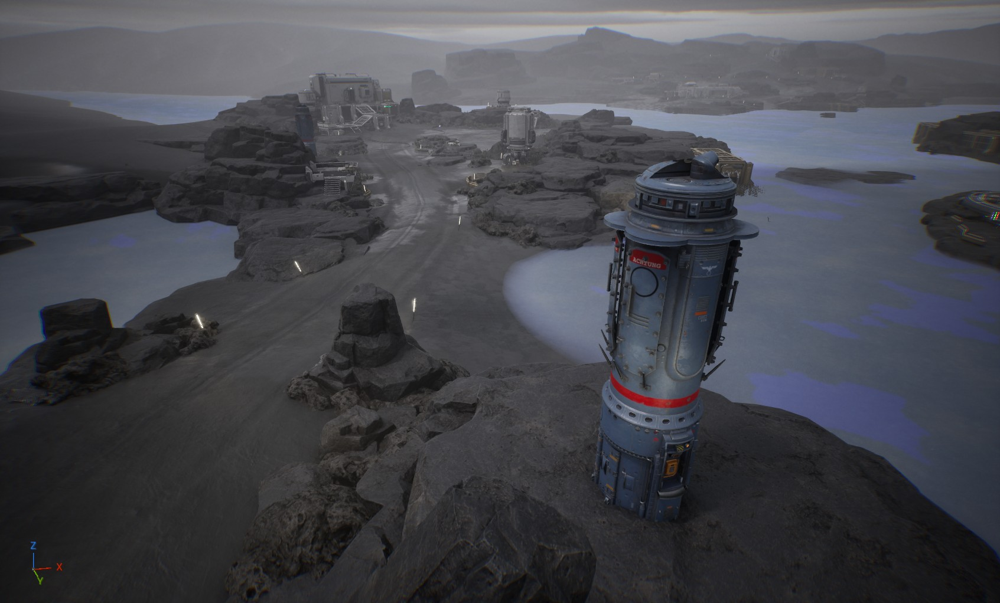
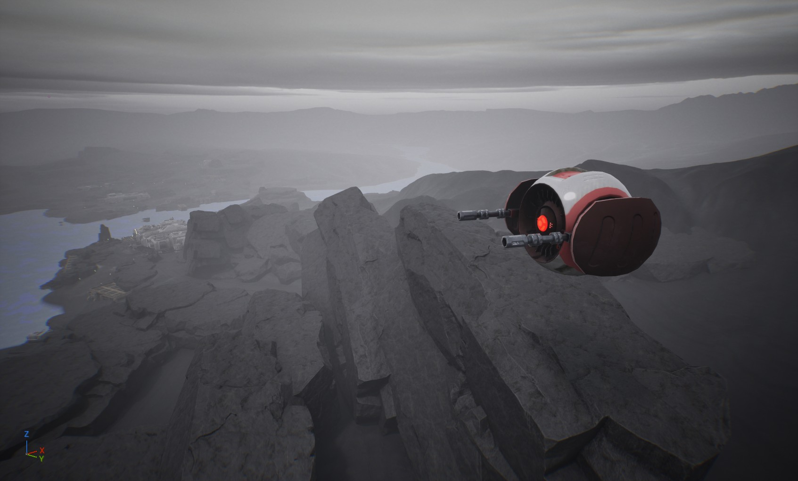
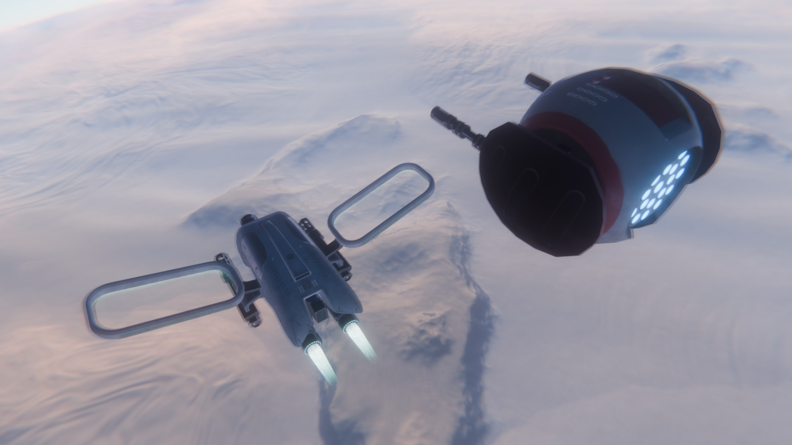
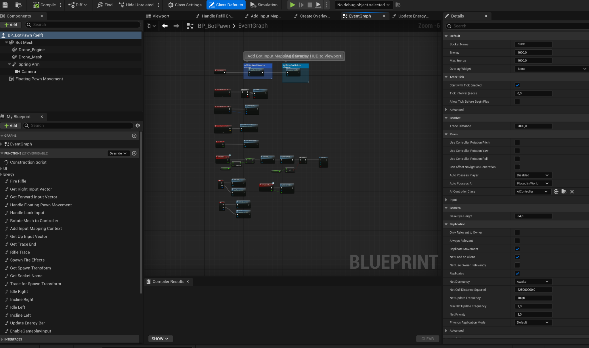
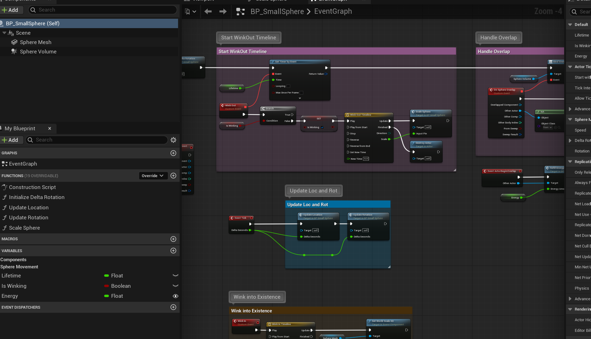
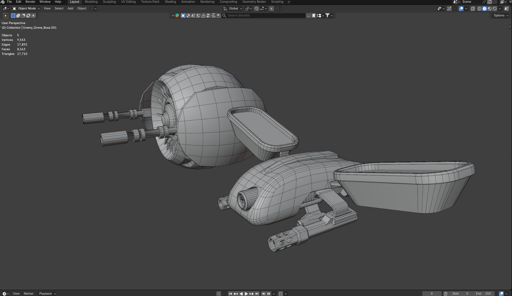
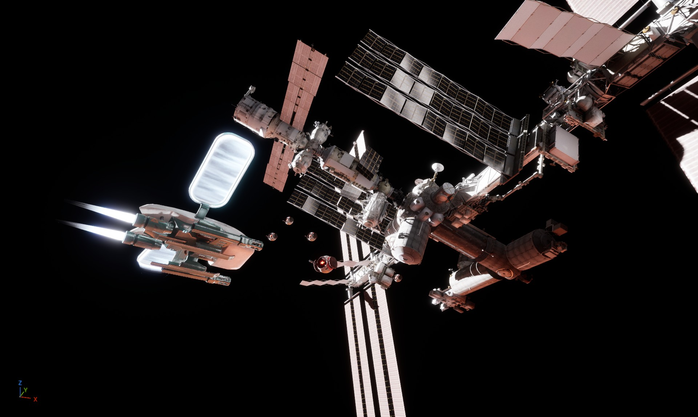

# A.I.R.A. Visual Development Overview

This section provides selected visual evidence from the current A.I.R.A. prototype and development workflow. It complements the C++ source review with directly viewable Unreal Engine, Blueprint, environment, and 3D-development material.

## 1. Relay Station Environment

In-engine environment view showing the remote research-station setting and relay infrastructure used by the playable prototype.

## 2. Relay Network Overview

A wider in-engine view of the station terrain and relay structures, providing context for the relay-network mission flow described in the C++ source.

## 3. Hostile Drone in the Environment

In-engine view of a hostile drone positioned above the planetary environment.

## 4. A.I.R.A. and Hostile Drone

Visual-development scene showing the player drone and a hostile drone together.

## 5. Drone Pawn Blueprint Event Graph

Unreal Engine Blueprint editor view for `BP_BotPawn`. It documents Blueprint-based player/drone gameplay logic and complements the native C++ systems included in `Source/`.

## 6. Energy Pickup Blueprint Event Graph

Unreal Engine Blueprint editor view for `BP_SmallSphere`, showing event-driven pickup/lifetime, overlap, transform, and energy-related logic.

## 7. Enemy Drone — Blender Wireframe

Blender modeling/wireframe view documenting part of the 3D asset production workflow for the drone-based gameplay.

## 8. Orbital Station Scene

In-engine orbital scene featuring the A.I.R.A. drone near a large space-station environment.

## Selection notes

The public review set intentionally excludes screenshots that contain:
- visible video-memory warning/error text;
- obsolete `N.E.R.V.E` UI branding from an earlier prototype state;
- near-duplicate views that add little additional technical evidence;
- editor-only duplicates when a cleaner in-engine view of the same scene is available.

This keeps the repository focused and avoids presenting outdated or misleading prototype states.
